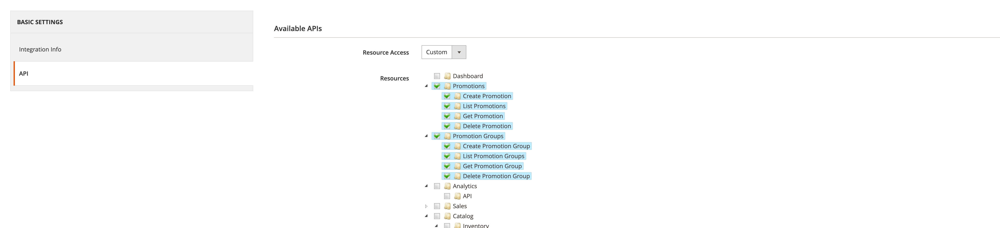

# KrystianLewandowski_Promotions module

## Installation

Get zip file from github and extract it to `app/code/KrystianLewandowski/Promotions` directory

`bin/magento setup:upgrade` <br> 
`bin/magento setup:di:compile` <br>
`bin/magento cache:clean` <br>
`bin/magento cache:flush` <br>

## Allow OAuth Access Tokens

Stores > `Configuration > Services > OAuth > Consumer Settings > Allow OAuth Access Tokens "YES"` <br> or: <br> 
`bin/magento config:set oauth/consumer/enable_integration_as_bearer 1`

## POSTMAN
In module directory `doc` you can find `Promotions.postman_collection.json` file with API requests <br>
In postman set `Authorization Bearer Token` From Admin Panel  `System > Integrations > Integration Info` `Access Token`<br>
Create If not exists and add `Resource Access` to `Promotions` and `Promotion Groups`<br>


## API

### Endpoints

#### Promotions

- **Create Promotion**
    - **URL:** `/V1/promotion/create`
    - **Method:** POST
    - **Request Body:**
      ```json
      {
        "name": "string",
        "promotionGroups": "array",
        "created_at": "string",
        "updated_at": "string"
      }
      ```


- **List Promotions**
    - **URL:** `/V1/promotions`
    - **Method:** GET
   `

- **Get Promotion by ID**
    - **URL:** `/V1/promotion/{id}`
    - **Method:** GET
 

- **Delete Promotion by ID**
    - **URL:** `/V1/promotion/delete/{id}`
    - **Method:** DELETE


#### Promotion Groups

- **Create Promotion Group**
    - **URL:** `/V1/promotionGroup/create`
    - **Method:** POST
    - **Request Body:**
      ```json
      {
        "promotionGroup":{
          "name": "Name Promotion Group",
          "promotions": "array"
        }
      }
      ```
  

- **List Promotion Groups**
    - **URL:** `/V1/promotionGroups`
    - **Method:** GET
  

- **Get Promotion Group by ID**
    - **URL:** `/V1/promotionGroup/{id}`
    - **Method:** GET


- **Delete Promotion Group by ID**
    - **URL:** `/V1/promotionGroup/delete/{id}`
    - **Method:** DELETE
  

## Security

### OAuth

- **Bearer Authentication**
    - **Type:** HTTP
    - **Scheme:** Bearer
    - **Bearer Format:** JWT